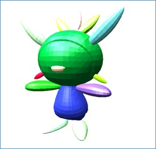
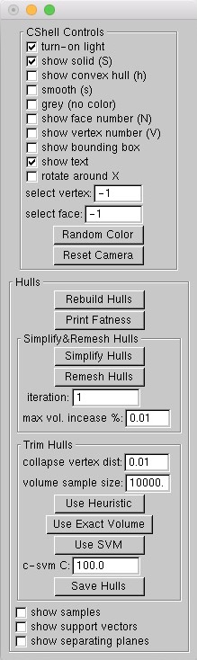

# Disjoint Convex Shell
#### Yun-hyeong Kim, Zhonghua Xi, Jyh-Ming Lien

Disjoint convex shell(DC-shell) is a set of disjoint convex objects approximating non-convex overlapping object sets.
The DC-shell method we proposed provides better approximation than those created by other methods. 
In addition, DC-shell enables faster collision response and realistic fracturing simulation by preventing convex objects from overlapping themselves.

DC-shell implements the algorithms described in the following paper: 
"Disjoint Convex Shell and its Applications in Mesh Unfolding", SPM 2017, by Yun-hyeong Kim, Zhonghua Xi, and Jyh-Ming Lien. 
([Web Site](http://masc.cs.gmu.edu/wiki/DCShell) / [Video](https://youtu.be/r8yK_nS0dVk))

## Description

The provided code constructs disjoint convex objects from overlapping or segmented parts as inputs.
The code can produce DC-shells created by LSF(least-squares fit) heuristic method, SVM, and exact volume optimization methods.
Moreover, before creating DC-shells, we can simplify and remesh the parts to decrease the complexity and increase their regularity.

To demonstrate the power of DC-shell, we studied how DC-shell can be used in mesh unfolding. 
The nets of polyhedra we used were created by [software tools](http://masc.cs.gmu.edu/wiki/Origami) developed by the [MASC group](http://masc.cs.gmu.edu) at George Mason University. 

## Requirements

The provided code can be run on Mac OS X and it was currently tested on a MacBook Air, with Mac OSX 10.9.5 and 10.11.6.
The required program and library are listed.

* Mac OS X 10.9.5 or newer
* CMake 2.6 or newer

	To install CMake program via [MacPorts](https://www.macports.org/), please type this in the terminal: `$ sudo port install cmake`

* CGAL

	The provided code requires only CGAL to install. Additional libraries are included in the "dcshell/lib" directory. 
	To install CGAL via MacPorts, please type this in the terminal: `$ sudo port install cgal +qt5`

## Instructions

* To compile the provided code, please type the commands below in the "dcshell" directory:

		$ chmod +x gen.sh
		$ ./gen.sh

	The provided code can be compiled using the script file, "gen.sh" and create a "dcshell" file linked to the execution file.

* To run the provided code, please type the command below in the "dcshell" directory, the root dirctory:

		$ ./dcshell <model_1.obj> <model_2.obj> ... <model_n.obj>

	This program takes one or more OBJ files. You can try to run this program following several steps in the Usage Section. 
	(**NOTE**: if you want to get disjoint convex objects from a given model, you need to segment it before running the the code.)

* To create figures or tables or plots our paper contains, please type this in the "dcshell/models/\*" directory: 
	
		$ sh run

	Once you type the script file, "run", it creates a "dcshell" file linked to the execution file and it runs with the segmented objects in the directory.

## Usage

This section is focused on and illustrates how to produce DC-shell step by step. 

1. Go to the "dcshell/models" directory in the repository and Go to one of the models' directories. For example, select the "Yoshi" directory.

	* In the directory, there is "yoshi-sep.obj". It will be used as an input model.

3. Run the DC-shell program by typing this: 
	
	`$ sh run`(this command will be used in the other model directory) or `$ ./dcshell yoshi-sep.obj`

	* Once you run the program, it would open both a window(left) and a control panel(right). You might see like this:

 

2. Press the '**h**' key to show the convex hulls.
3. Press the '**Simplify Hulls**' button to simplify the convex hulls.

	* Before pressing the button, set the '**iteration**' and '**maximum volume increase**' parameters. 

4. Press the '**Remsh Hulls**' button to remesh the convex hulls.

	* Before pressing the button, set the '**iteration**' and '**maximum volume increase**'parameters.
	* Once the remeshing process is started, the weighted average fatness for every iteration at different percentages of maximum volume increase will be recorded in the "*_fatness_all.txt" file. 
	* To check the current weighted average fatness, press the '**Print Fatness**' button.

5. Press one of the three buttons such as'**Use Heuristic**', '**Use Exact Volume**', and '**Use SVM**' to make the hulls disjoint.

	* Before pressing the button, set '**collapse vertex dist**', '**volume sample size**', and '**c-svm C**' parameters.
	* The cost parameter, '**c-svm C**', affects both running time and output quality.

		* If '**c-svm C**' is lower, then both the computation time and the output quality increase.
	
	* These buttons use the methods

		* The '**Use Heuristic**' button: trimming the given objects using the least-squares fit (LSF) method
		* The '**Use Exact Volume**' button trimming the given objects using the exact volume computation method
		* The '**Use SVM**' button: trimming the given objects using the support vector machine (SVM) method
	
6. Press the '**Save Hulls**' button to save the resulting objects. Those resulting files are in the same directory where the Yoshi model exists.

7. To reset all of the processes, press '**Rebuild Hulls**'.

## Model

In the "dcshell/models" directory, there are models manually segmented into several parts.
Most of the original models used in this paper are obtained from [Thingiverse](http://thingiverse.com) and all Pokemon models are from [ROEStudios](http://roestudios.co.uk/project/3d-pokemon-models/).
